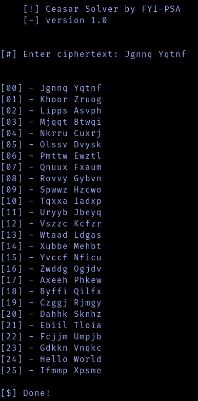

# Caesar-Solver
 A simple and useful Caesar Cipher decryption tool.

## Usage
- Run the file "`Caesar_Salad.py`" with Python 3

- Give it a Caesar Cipher encrypted message and it will solve all 26 possibilities.

*Here on the 25th iteration with a shift of +24 you can see that the message is correctly decrypted as "Hello World"*
