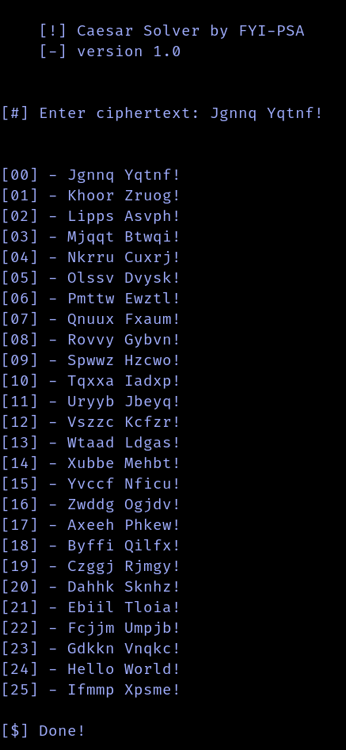

# Caesar-Solver
 A simple and useful Caesar Cipher decryption tool.


## Usage
- Run the file "Caesar_Salad.py" with Python 3:

    - Clone the repository:
    ```sh
    git clone https://github.com/FYI-PSA/Caesar-Solver.git && cd Caesar-Solver
    ```
    - Then run the file:
    ```sh
    python3 Caesar_Salad.py
    ```

- Give it a Caesar Cipher encrypted message and it will solve all 26 possibilities.



*Here on the 25th iteration with a shift of +24 you can see that the message is correctly decrypted as "Hello World"*
